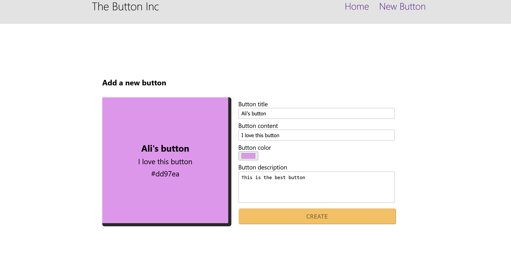

# The Buttonc Inc App

This project was created to learn React and is used to create buttons. Below are image previews from the `previews` folder.

## Image Previews




## Setup Instructions

To set up the project, follow these steps:

1. Install the necessary dependencies:
    ```bash
    npm install
    ```

2. Start the React development server:
    ```bash
    npm start
    ```

3. Start the JSON server using `ngx`:
    ```bash
    npx json-server --watch db.json
    ```

Enjoy exploring the project and learning React!